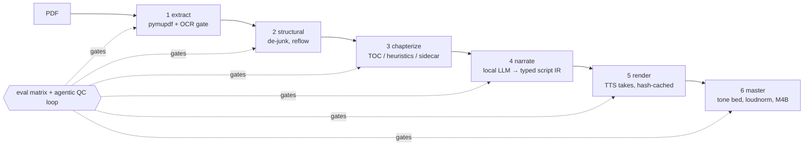

# 🎧 pdf2audiobook

**Turn any PDF into a finished, QC-gated audiobook, fully local, on Apple Silicon.**

I love old books and academic works: colonial memoirs, 1920s museum leaflets,
out-of-print monographs, translations of chronicles nobody has touched since
the Victorians. None of them will ever get an audiobook on Audible; the
market isn't there. So I built the studio: a compiler-style pipeline that
takes a scanned PDF and produces a mastered M4B with chapters, cover art, and
a narrator voice of your choosing, so these rare works can ride along on a
commute.

## 🎯 Why is this different from hundreds of other TTS projects?

**QC is the product.** PDF transcription and TTS both fail constantly:
OCR junk mid-sentence, running headers read aloud, stutters, skipped
words, voice drift, clipped phonemes. Every one of those is treated as a
first-class engineering problem:

- **Every take is heard before it ships.** Each rendered segment is
  transcribed back with Whisper and judged by a local LLM against the
  source text, catching stutters, skips, and invented words.
- **Every stage is gated by evals.** A committed baseline turns narration
  quality into a regression suite: a change that degrades extraction,
  chapterization, or takes fails the build like a broken test.
- **Failures are repaired, not shipped.** Bad takes re-render on a retry
  budget; stubborn ones get their text adjudicated for speakability (a
  sentence split, a respelled hard word) instead of mangling the author's
  prose. Whatever still fails is surfaced for a human ear.
- **Voice drift is measured.** Every take's speaker embedding is compared
  against the render's own voice centroid, so the narrator at the end of
  the book is the narrator from the first chapter.
- **Room tone is engineered.** Takes render dry and are leveled onto a
  continuous room-tone bed, so pauses sound like a recording room
  breathing, not digital silence spliced between files.
- **Pacing is a config value, not a re-record.** Pauses, heading air, and
  loudness live in the assembly stage, so re-pacing an entire book takes
  seconds and re-renders nothing.
- **Prosody comes from the reference, so the reference is engineered
  too.** voice-grab scouts a clean single-speaker window from real audio;
  voice-distill then banks a generated reference that provably ends on a
  complete sentence, because a mid-thought reference makes every take
  hallucinate a continuation.
- **Cost is managed by construction.** Takes are content-addressed and
  immutable: killing a five-hour render costs nothing, and a text fix
  re-renders only the changed segments. Everything runs on free open-source
  models; the same loop on API pricing (Claude-class tokens for narration
  and judging plus per-character commercial TTS) would be several hundred
  dollars per audiobook, times every wasted run while you tune parameters
  and voice references.

> 🔊 **Hear it**: the opening of *The Velveteen Rabbit* (1922, public
> domain), narrated by a voice cloned from Dylan Thomas (d. 1953), mastered
> on the pipeline's room-tone bed, cover art generated and composited by the
> cover stage:

https://github.com/user-attachments/assets/63867849-f069-473f-911e-2e3483a3e07d

## ⚙️ How it works



Every stage writes an inspectable artifact. A matrix of deterministic checks
plus LLM-judged reviews gate each one; failures feed back as targeted
re-renders with a retry budget, and stubborn takes get their text adjudicated
for speakability. Nothing ships unheard.

| Stage | Does | Artifact |
|------|------|----------|
| 1 extract | pymupdf layout blocks + embedded TOC; OCR gate (ocrmypdf) | `01_extract.json` |
| 2 structural | de-header/footer, de-hyphenate, reflow across page breaks | `02_body.txt` |
| 3 chapterize | TOC-first, heading fallback, `<book>.chapters.yaml` override | `03_chapters.json` |
| 4 narrate | local Qwen (Ollama) → typed sentence-level script (numbers verbalized, titles deduped, honorific-safe splits) | `04_narration.json` |
| 5 render | Kokoro (fast draft) or Qwen3-TTS (cloned voice); dry takes, content-hash cached | `05_render/` |
| 6 master | per-take leveling onto a continuous room-tone bed, loudnorm, M4B + chapter files | `output/<book>/` |

**Takes are dry and immutable**: speech only, content-addressed by
`(engine, params, text)`. Pauses, room tone, and mastering happen at
assembly, so pacing, tone, and level changes re-run stage 6 only
(`main.py reassemble`), with zero re-recording. Killing a 5-hour render
costs nothing; it resumes from cache.

## 🎙️ Voices

```bash
# Find + bank a narrator reference from any YouTube interview
python3 main.py voice-grab my_narrator "https://youtube.com/watch?v=…" --start 9:42 --end 10:38

# Then distill it: generate a cleaner synthetic reference from the clone itself
python3 main.py voice-distill my_narrator
```

`voice-grab` scouts the clip with Whisper, has the local LLM pick a fluent
single-speaker window, banks ~25s plus a room-tone sidecar, and audits the
result (pitch spread, onset artifacts). `voice-distill` then synthesizes
candidate takes with the fresh clone, QCs them (transcript fidelity, speaker
similarity, onset audit), and banks the best **generated** take as the
production reference: no room noise, no interviewer bleed, and it provably
ends on a complete sentence (a mid-thought reference makes every take
hallucinate a continuation).

The stage-5 QC reviews every take: Whisper transcript vs. source judged by a
local LLM for stutters, skips, and insertions; onset-shape analysis; speaker
similarity against the render's own voice centroid.

Voice references are never committed; clone voices you have rights to. The
demo sample uses a reference from Dylan Thomas (d. 1953) reading
public-domain text. Recordings, reference audio, and source PDFs all stay
local.

## 🚀 Quickstart

```bash
pip install -r requirements.txt
pip install "git+https://github.com/QwenLM/Qwen3-TTS.git"   # cloned-voice TTS
brew install ffmpeg ocrmypdf sox
ollama pull qwen:latest                                      # stage-4 narrator + judge

# Fast draft, preset voice
python3 main.py build book.pdf --fast

# Cloned voice, full QC, into Apple Books
python3 main.py build book.pdf --engine qwen3tts --voice voices/my_narrator.wav
python3 main.py publish <book_id>

# Evals
python3 -m evals.run --diff       # gate against the committed baseline
```

Optional extras: `deepfilternet` (reference denoise), `mflux` (cover-art
generation; `main.py cover` embeds any square PNG), `transformers`
(MusicGen intro beds), `scripts/vast/` (remote CUDA renders on vast.ai with
push/render/status/pull control plane).

## 🤖 Driving it with Claude

The repo ships Claude Code skills in `.claude/skills/`:

- **`/grab-voice <name or URL>`**: find a good long-form source on YouTube,
  scout it, bank and QC a reference, distill it.
- **`/build-audiobook`**: the full PDF-to-M4B playbook: source vetting,
  extraction preview, chapter sidecars, QC-loop triage (including
  listen-and-waive for ASR false positives and snip-don't-reroll for onset
  artifacts), mastering, cover art, delivery.
- **`/check-build`**: live progress and ETA for a running render, stall
  diagnosis, safe resume (takes are cached), and review-queue triage for a
  halted build.
- **`/tune-audiobook`**: iterate pacing, pauses, room tone, and loudness on
  a finished book without re-rendering a take (stage-6 reassembly loop).
- **`/run-evals`**: run the eval matrix, gate against the committed
  baseline, interpret regressions, and update the baseline deliberately.

`CLAUDE.md` encodes the project's working doctrine (immutable takes,
LLM-judgment-with-deterministic-fallback, never rewriting the author's
prose).

## 🧪 Eval corpus

The committed corpus and golden files use public-domain texts (Patterson's
1925 *Man-Eating Lions of Tsavo* leaflet, with assertions that survive OCR
hyphen breaks, running headers, and footnote interleaving). Point
`evals/corpus.yaml` at your own library; PDFs stay untracked.

## 📜 License

[PolyForm Noncommercial 1.0.0](LICENSE): free for personal, research, and
other noncommercial use. For commercial licensing, open a GitHub issue.

Hardware reference: M3 Max, 64 GB. A ~13k-word book renders locally in a few
hours; a 100k-word book is an overnight job or a vast.ai afternoon.
